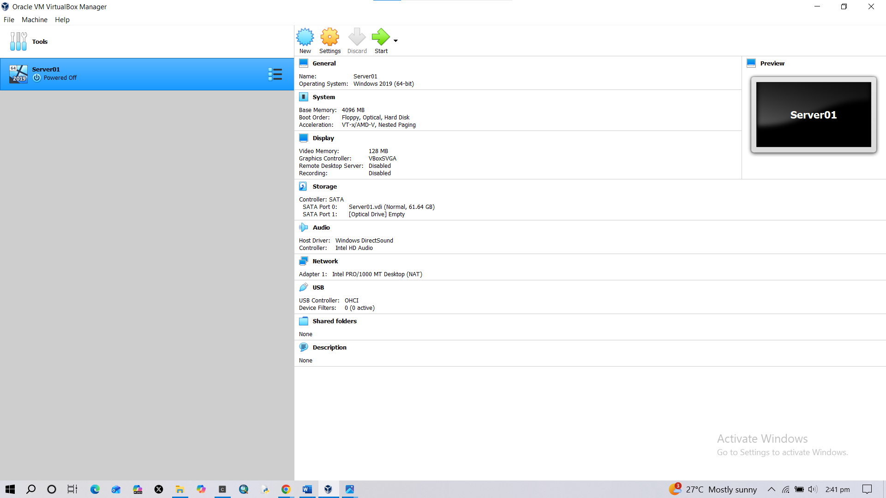
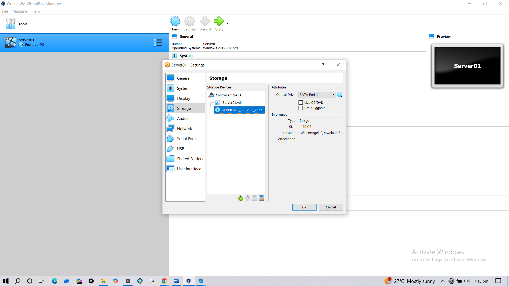
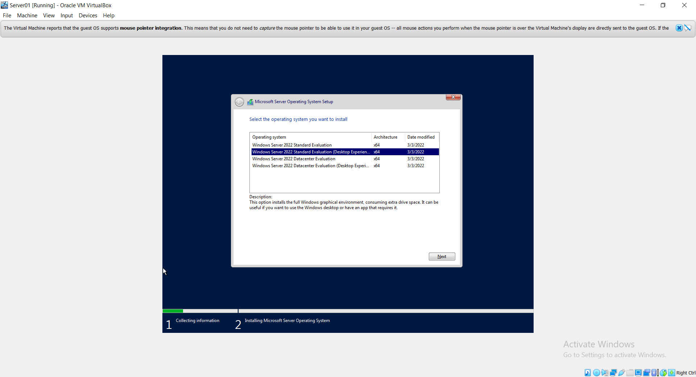

# Windows Server Installation

## Overview

This document covers the creation and installation of a Windows Server virtual machine using Oracle VirtualBox.

The server will later be configured as a Domain Controller for the Active Directory Home Lab.

---

# Objective

The objectives of this stage are:

- Create a Windows Server virtual machine
- Configure virtual hardware resources
- Attach Windows Server ISO
- Install Windows Server
- Prepare the server for Active Directory configuration

---

# Lab Environment

| Component | Details |
|---|---|
| Host Machine | Personal Laptop |
| Virtualization Software | Oracle VirtualBox |
| Operating System | Windows Server 2022 Evaluation |
| VM Name | Server01 |

---

# Virtual Machine Configuration

| Resource | Allocation |
|---|---|
| RAM | 4GB |
| CPU | 2 Cores |
| Storage | 60GB |
| Network Adapter | NAT |
| Disk Type | Dynamically Allocated |

---

# Installation Steps

## Step 1: Creating the Virtual Machine

Created a new virtual machine named: 

Configured the following:

- Windows Server operating system
- 4GB RAM
- 2 CPU cores
- 60GB virtual hard disk

Screenshot:

---

## Step 2: Mounting Windows Server ISO

The Windows Server installation ISO was attached through:

Screenshot:

---

## Step 3: Troubleshooting Boot Error

During the first startup attempt, VirtualBox displayed:

### Cause

The virtual machine did not have a bootable installation media attached.

### Solution

The Windows Server ISO was attached through the VirtualBox storage settings.

After attaching the ISO, the installation process continued successfully.

Screenshot:

---

## Step 4: Windows Server Installation

The installation process included:

- Selecting language preferences
- Choosing Windows Server edition
- Accepting license terms
- Selecting custom installation
- Installing Windows Server

Screenshot:

---

# Skills Demonstrated

- Virtual machine deployment
- VirtualBox administration
- Windows Server installation
- Troubleshooting boot issues
- Documentation skills

---

# Lessons Learned

A virtual machine requires a bootable operating system image before installation can begin.

When VirtualBox cannot detect an ISO or bootable disk, it displays the "No bootable medium found" error.

---

# Next Steps

The next phase will cover:

- Initial Windows Server configuration
- Renaming the server
- Static IP configuration
- Installing Active Directory Domain Services

