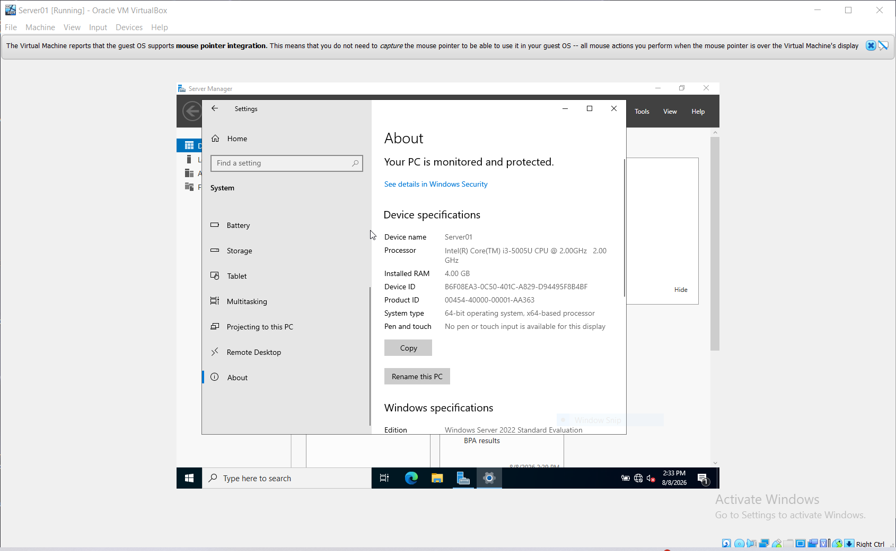
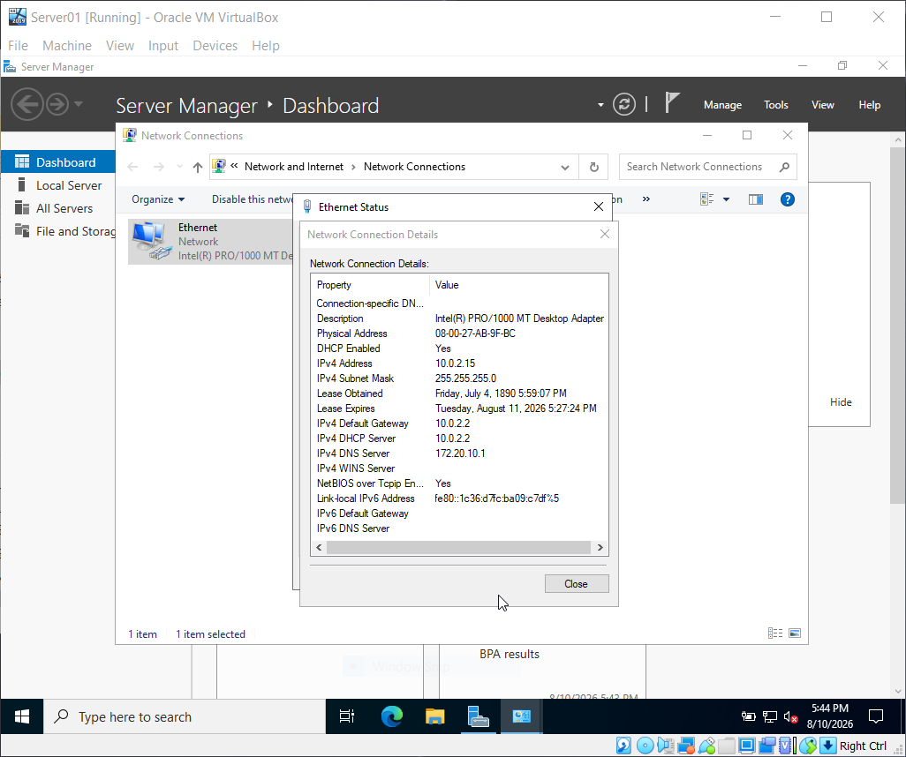
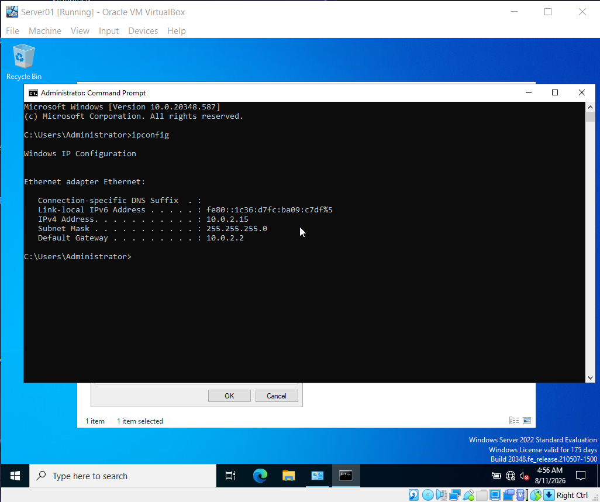
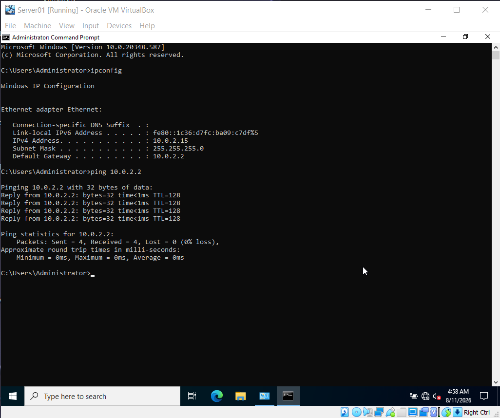
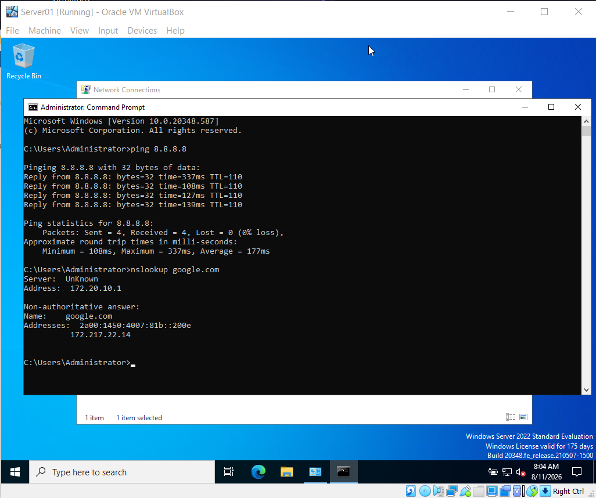
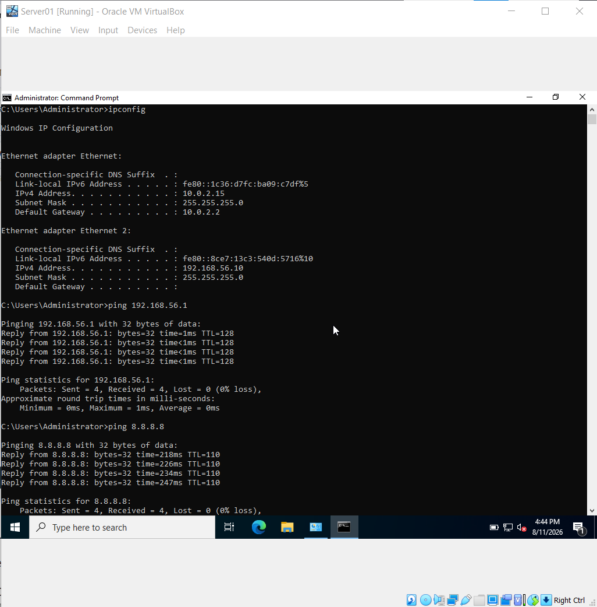

# Initial Windows Server Configuration

## Overview

This section documents the initial configuration of the Windows Server virtual machine before deploying Active Directory Domain Services.

The server will be used as the primary server for the Active Directory home lab.

## Server Information

| Configuration | Value |
|---|---|
| Server Name | Server01 |
| Operating System | Windows Server |
| Virtualization Platform | Oracle VirtualBox |
| Purpose | Active Directory Domain Controller |

---

## Step 1: Rename the Server

The Windows Server computer name was configured as:

```text
Server01
```

A descriptive server name makes it easier to identify the server when managing multiple systems in a network.

### Screenshot



---

## Result

The server was successfully renamed to `Server01` and restarted to apply the change.

## Next Step

The next step is to configure a static IP address for Server01.

## Step 2: Reviewing Current Network Configuration

Before assigning a static IP address, the existing network configuration was reviewed.

The server was initially configured to obtain its network settings automatically through DHCP.

### Current Configuration

| Setting | Value |
|---|---|
| DHCP | Enabled |
| IPv4 Address | 10.0.2.15 |
| Subnet Mask | 255.255.255.0 |
| Default Gateway | 10.0.2.2 |
| DHCP Server | 10.0.2.2 |
| DNS Server | 172.20.10.1 |

### Why This Matters

A server used for Active Directory should have a predictable IP address. Dynamic addressing can cause the server's IP address to change, which can create problems for services that depend on a consistent address.

The next step will be to configure a static IP address for Server01.

### Screenshot



## Step 3: Configuring a Static IP Address

The Server01 virtual machine was initially configured to obtain its IP address automatically through DHCP.

Because the server will later host Active Directory Domain Services and DNS, a static IP address was configured to provide a predictable network address.

### Static IP Configuration

| Setting | Value |
|---|---|
| IP Address | 10.0.2.15 |
| Subnet Mask | 255.255.255.0 |
| Default Gateway | 10.0.2.2 |
| Preferred DNS | 10.0.2.2 |

### Configuration Process

1. Opened Network Connections using `ncpa.cpl`.
2. Opened the Ethernet adapter properties.
3. Opened Internet Protocol Version 4 (TCP/IPv4).
4. Changed the IP configuration from automatic to manual.
5. Entered the static IP configuration.
6. Saved the settings.
7. Used `ipconfig` to verify the configuration.
8. Used `ping` to test connectivity to the VirtualBox NAT gateway.

### Network Test

The ping test returned four successful replies with:

```text
Packets: Sent = 4, Received = 4, Lost = 0 (0% loss)
```

This confirmed that Server01 can communicate with the VirtualBox NAT gateway.

### Screenshots

#### Static IP Configuration



#### Network Connectivity Test



### Result

Server01 was successfully configured with a static IP address and connectivity to the VirtualBox NAT gateway was verified.

## Step 4: Testing Internet Connectivity and DNS Resolution

After configuring the static IP address, network connectivity and DNS name resolution were tested.

### Internet Connectivity Test

The following command was used:

```text
ping 8.8.8.8
```

The test returned four successful replies with:

```text
Packets: Sent = 4, Received = 4, Lost = 0 (0% loss)
```

This confirmed that Server01 could successfully reach an external IP address through the VirtualBox network.

### DNS Resolution Test

The following command was used:

```text
nslookup google.com
```

The test successfully resolved `google.com` to an IP address.

This confirmed that DNS name resolution was working before the Active Directory deployment.

### Screenshot



## Step 5: Configuring the Private Host-Only Network

A second network adapter was configured on Server01 to provide a dedicated private network for the Active Directory lab.

### Network Adapter Configuration

| Adapter | Network Type | IP Address | Purpose |
|---|---|---|---|
| Ethernet | NAT | 10.0.2.15 | Internet access |
| Ethernet 2 | Host-Only | 192.168.56.10 | Private lab network |

The Host-Only adapter uses the `192.168.56.0/24` network.

### Ethernet 2 Configuration

| Setting | Value |
|---|---|
| IP Address | 192.168.56.10 |
| Subnet Mask | 255.255.255.0 |
| Default Gateway | None |
| Preferred DNS | 192.168.56.10 |

The default gateway was intentionally left blank because Ethernet 2 is dedicated to the private lab network. Internet traffic continues to use the NAT adapter.

### Network Testing

The Host-Only connection was tested by pinging the host computer:

```text
ping 192.168.56.1
```

Internet connectivity was also tested through the NAT adapter:

```text
ping 8.8.8.8
```

### Screenshot



### Result

Server01 successfully uses two separate network interfaces:

- NAT for Internet connectivity.
- Host-Only for private Active Directory lab communication.


