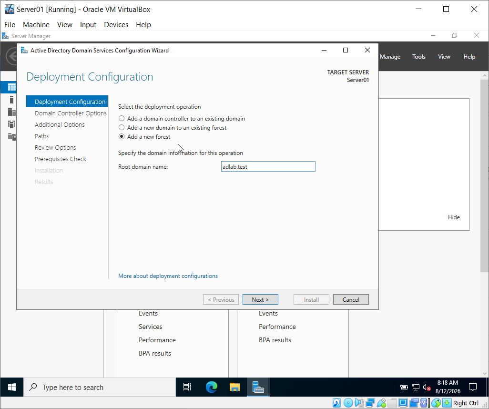
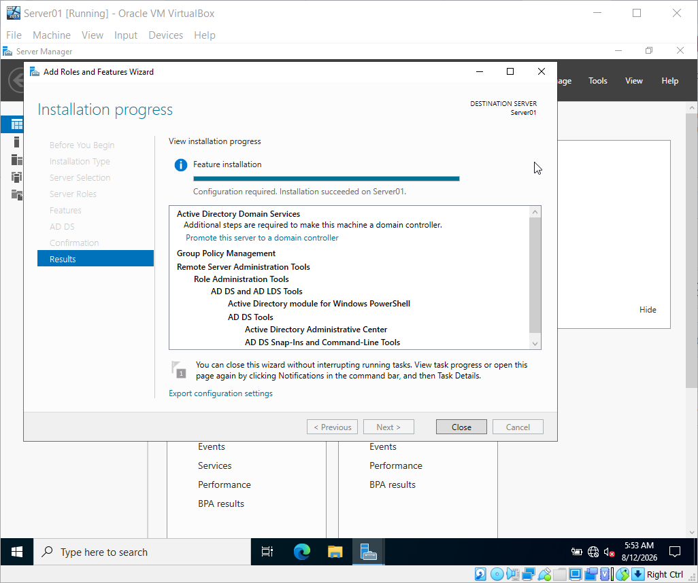
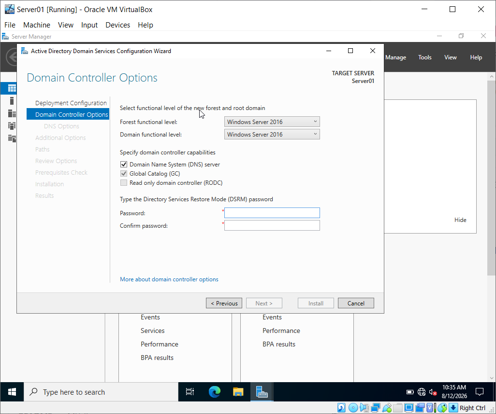
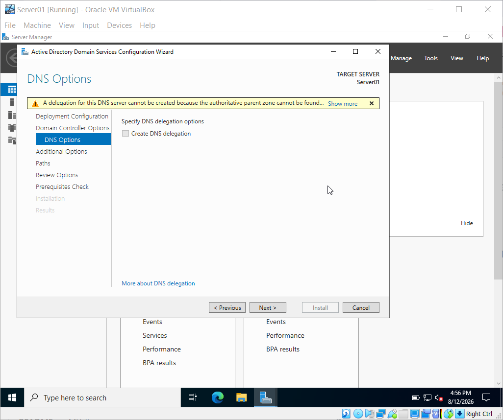
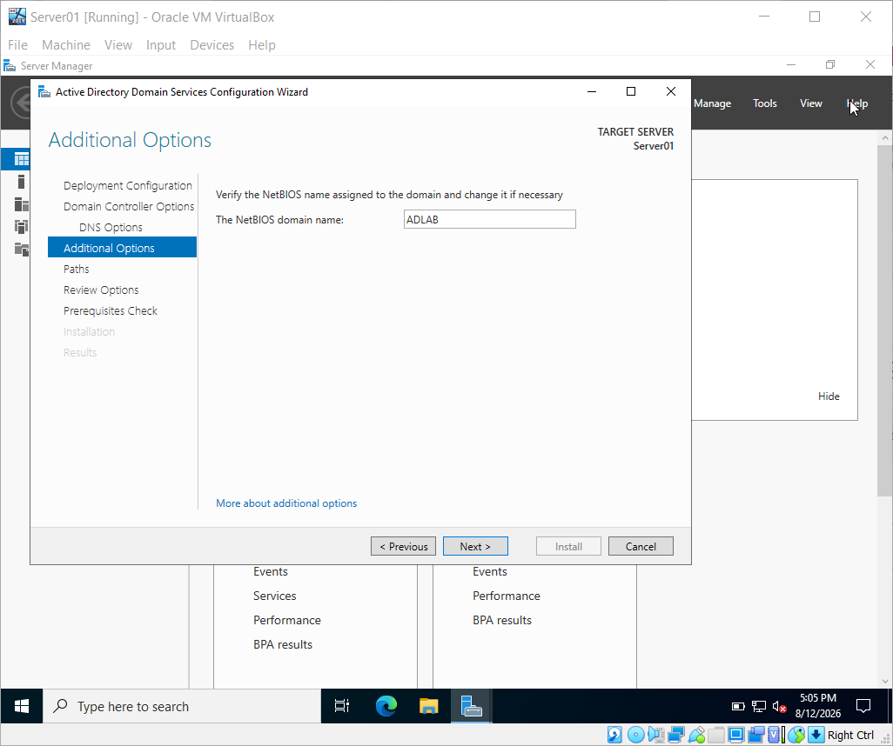
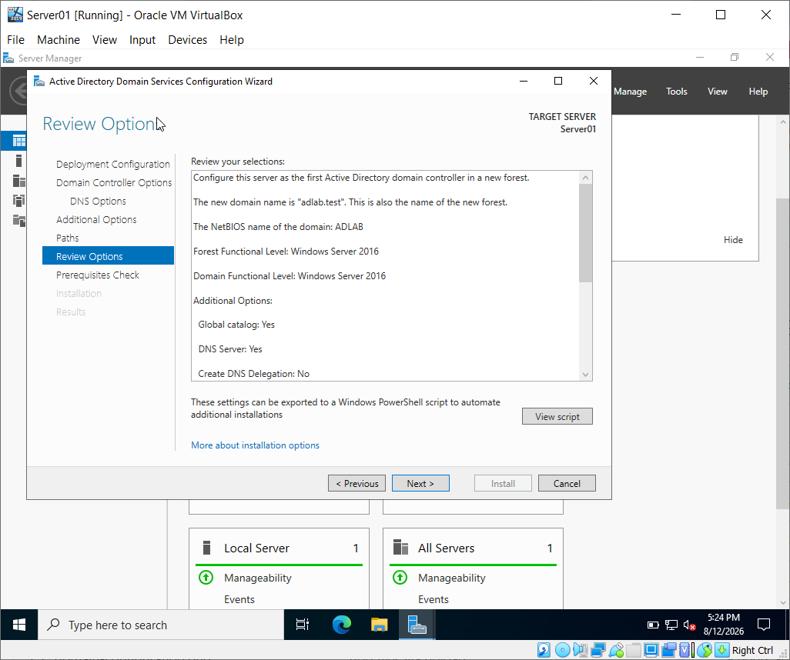
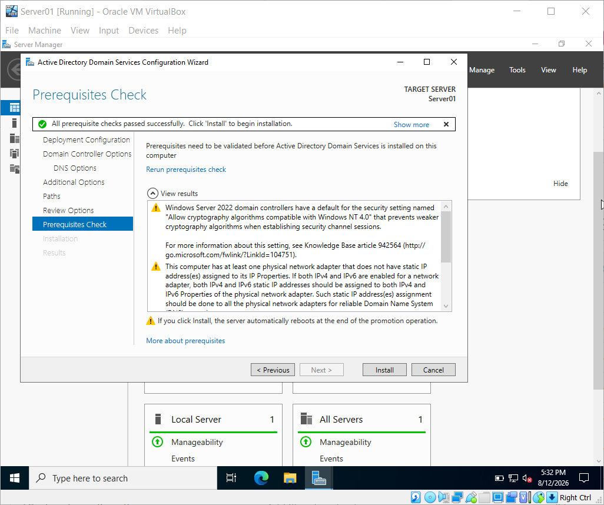

# Active Directory Domain Services

## Overview

This section documents the installation and configuration of Active Directory Domain Services (AD DS) on Server01.

Server01 will be configured as the first Domain Controller for the lab environment.

### Lab Domain

```text
adlab.test
```

### Server Information

| Setting | Value |
|---|---|
| Server Name | Server01 |
| Server IP | 192.168.56.10 |
| Operating System | Windows Server |
| Domain | adlab.test |
| Role | Domain Controller |

## Objectives

- Install Active Directory Domain Services.
- Configure Server01 as a Domain Controller.
- Create the `adlab.test` domain.
- Configure DNS as part of the domain controller deployment.
- Verify that Active Directory is functioning correctly.

## Step 1: Installing the Active Directory Domain Services Role

The Active Directory Domain Services role was installed on Server01 using Server Manager.

### Installation Process

1. Opened Server Manager.
2. Selected **Add Roles and Features**.
3. Selected **Role-based or feature-based installation**.
4. Selected Server01 as the destination server.
5. Selected **Active Directory Domain Services**.
6. Added the required features.
7. Reviewed the installation options.
8. Installed the AD DS role.

### Screenshot

## Step 2: Configure the Active Directory Domain

After installing Active Directory Domain Services (AD DS), I opened
the Active Directory Domain Services Configuration Wizard.

I selected:

- Deployment operation: Add a new forest
- Root domain name: `adlab.test`

The `adlab.test` domain was created as a new Active Directory forest.





### Result

The Active Directory Domain Services role was successfully installed on Server01.

The next step is to promote Server01 to a Domain Controller and create the `adlab.test` domain.

## Step 3: Configure Domain Controller Options

I configured Server01 as the first Domain Controller for the new
`adlab.test` forest.

The following settings were used:

- Forest functional level: Windows Server 2016
- Domain functional level: Windows Server 2016
- DNS Server: Enabled
- Global Catalog: Enabled
- Read-only Domain Controller (RODC): Disabled

I also created a Directory Services Restore Mode (DSRM) password
for Active Directory recovery purposes.




## Step 4: Configure DNS

DNS Server was enabled as part of the Domain Controller
configuration.

DNS delegation was left unchecked because this is a standalone
home lab with no existing parent DNS infrastructure.




## Step 5: Configure NetBIOS Domain Name

The NetBIOS domain name was automatically configured as:

`ADLAB`

The Active Directory environment therefore uses:

- Fully qualified domain name: `adlab.test`
- NetBIOS domain name: `ADLAB`



## Step 6: Configure Active Directory Storage Paths

The default Active Directory storage locations were retained.

- Database folder: `C:\Windows\NTDS`
- Log files folder: `C:\Windows\NTDS`
- SYSVOL folder: `C:\Windows\SYSVOL`

These defaults were appropriate for the home lab environment.


## Step 7: Review Active Directory Configuration

Before beginning the installation, I reviewed the Active Directory
configuration.

The configuration included:

- New forest: `adlab.test`
- NetBIOS name: `ADLAB`
- DNS Server: Enabled
- Global Catalog: Enabled
- Forest functional level: Windows Server 2016
- Domain functional level: Windows Server 2016
- Database path: `C:\Windows\NTDS`
- Log path: `C:\Windows\NTDS`
- SYSVOL path: `C:\Windows\SYSVOL`




## Step 8: Check Installation Prerequisites

Before installing Active Directory Domain Services, Windows Server
performed a prerequisite check.

The check completed successfully with:

> All prerequisite checks passed successfully.

This confirmed that Server01 met the requirements for Domain
Controller promotion.




## Step 9: Promote Server01 to a Domain Controller

After all prerequisite checks passed successfully, I started the
installation.

The Active Directory Domain Services configuration process created
the new `adlab.test` forest and promoted Server01 to a Domain
Controller.

Server01 restarted automatically after the installation.

The resulting environment is:

- Server: `Server01`
- Domain: `adlab.test`
- NetBIOS domain: `ADLAB`
- Domain Controller IP: `192.168.56.10`## Step 9: Promote Server01 to a Domain Controller

After all prerequisite checks passed successfully, I started the
installation.

The Active Directory Domain Services configuration process created
the new `adlab.test` forest and promoted Server01 to a Domain
Controller.

Server01 restarted automatically after the installation.

The resulting environment is:

- Server: `Server01`
- Domain: `adlab.test`
- NetBIOS domain: `ADLAB`
- Domain Controller IP: `192.168.56.10`

## Step 10: Verify Active Directory and DNS

After Server01 restarted, I verified the Active Directory
environment using Command Prompt.

### Verify the logged-in domain

Command:

```cmd
whoami

### Verify Domain Controller Advertising

I also verified that Server01 was properly advertising itself as a
Domain Controller.

Command:

```cmd
dcdiag /test:advertising

